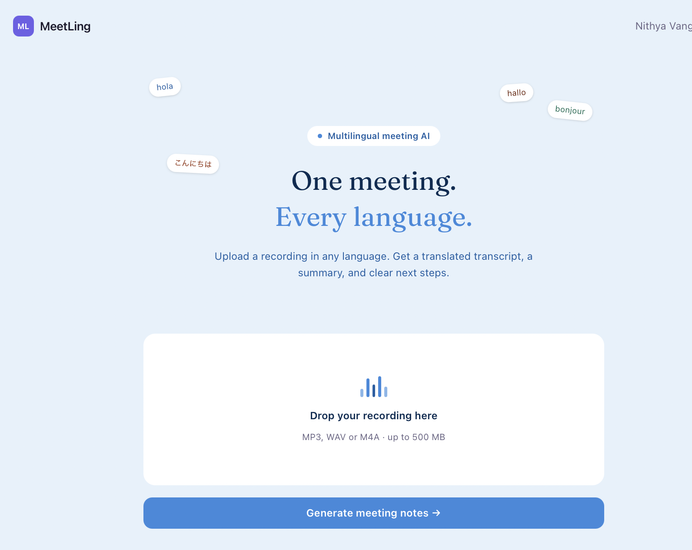
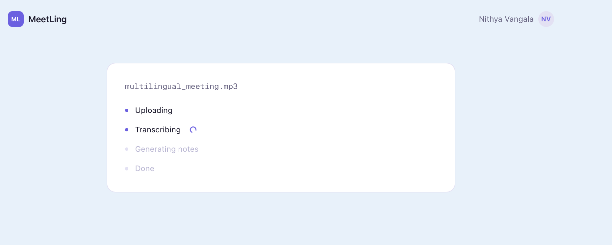
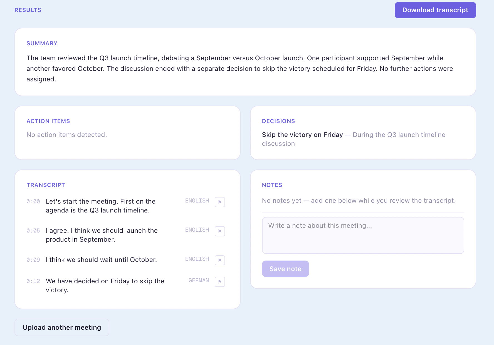

# AI Fullstack Multilingual Meeting Notes Generator

An AI application that transcribes multilingual meeting recordings, translates them into English, and generates structured notes — a summary, action items, and key decisions — automatically.

Built as a full-stack system: upload an audio file, and within minutes get a clean transcript and AI-generated notes, no matter what language(s) were spoken.

## What it does

- **Transcribes audio** in any of Whisper's ~99 supported languages
- **Translates automatically** to English, even when a recording switches between multiple languages mid-conversation
- **Generates structured notes** — summary, action items (with owner/deadline when mentioned), and decisions — using an LLM
- **Flags uncertain transcription** — low-confidence or unclear audio segments are marked for manual review instead of being silently guessed at
- **Lets viewers add notes** — reviewers can attach their own comments to a meeting, optionally flagged for follow-up
- **Exports a clean transcript** as a downloadable text file, including viewer notes and flagged lines

## Demo





## Tech stack

**Frontend:** Next.js, TypeScript, Tailwind CSS
**Backend:** FastAPI (Python)
**Background processing:** Celery + Redis (so transcription doesn't block the HTTP request)
**Speech-to-text & translation:** OpenAI Whisper (`small` model, run locally)
**Notes generation:** Llama 3 via Groq API
**Database:** PostgreSQL via Supabase

## Architecture
Upload audio (Next.js)
│
▼
FastAPI validates file (length, format)
│
▼
Celery job queued (Redis)
│
▼
Audio split into ~12s chunks
│
▼
Each chunk: Whisper transcribes + translates to English
│
▼
Segments saved to Postgres, with:
detected source language
a lightweight speaker-turn heuristic (alternates on long pauses)
a "needs review" flag for low-confidence lines
│
▼
Full transcript sent to Llama 3 (via Groq)
│
▼
Summary + action items + decisions saved to Postgres
│
▼
Frontend polls status, then displays results

## Why chunked transcription

Whisper's language detection runs once per audio window and can "drift" — if it locks onto one language early, it tends to stick with it even when the speaker switches languages later in the recording. Splitting the audio into short (~12 second) independent chunks and re-detecting language on each one fixes this, at the cost of some extra processing overhead.

## Known limitations

- **Speaker labels are a heuristic, not true diarization.** Speaker turns are guessed based on pauses in speech (a gap over ~1.2s toggles between "Speaker 1" and "Speaker 2"), not actual voice identification. A production version would use `pyannote.audio` for real diarization.
- **Recordings are capped at 30 minutes.** Longer files can exceed the LLM's context window during notes generation. Transcription itself would still work; the notes step would need to run in batches for longer recordings.
- **Accuracy varies by language.** Whisper's training data isn't evenly distributed across languages — well-resourced languages (English, Spanish, French, German) transcribe more reliably than lower-resource ones.
- **Runs locally, not deployed.** This currently requires running the backend, worker, and frontend locally (see setup below). No hosted demo yet.

## Setup

### Prerequisites
- Python 3.10+
- Node.js 18+
- Redis (`brew install redis` on Mac)
- ffmpeg (`brew install ffmpeg` on Mac)
- A free [Supabase](https://supabase.com) project (Postgres + storage)
- A free [Groq](https://console.groq.com) API key

### Backend

```bash
cd backend
python3 -m venv .venv
source .venv/bin/activate
pip install -r requirements.txt
cp ../.env.example .env   # fill in your Supabase and Groq credentials
```

Create the database tables in your Supabase project's SQL editor:

```sql
CREATE TABLE meetings (
  id UUID PRIMARY KEY,
  title TEXT,
  status TEXT DEFAULT 'pending',
  created_at TIMESTAMPTZ DEFAULT now()
);

CREATE TABLE segments (
  id UUID PRIMARY KEY DEFAULT gen_random_uuid(),
  meeting_id UUID REFERENCES meetings(id) ON DELETE CASCADE,
  speaker TEXT,
  start FLOAT,
  text TEXT,
  language TEXT,
  needs_review BOOLEAN DEFAULT false
);

CREATE TABLE notes (
  id UUID PRIMARY KEY DEFAULT gen_random_uuid(),
  meeting_id UUID REFERENCES meetings(id) ON DELETE CASCADE,
  summary TEXT,
  action_items JSONB,
  decisions JSONB,
  languages JSONB,
  generated_at TIMESTAMPTZ DEFAULT now()
);

ALTER TABLE meetings DISABLE ROW LEVEL SECURITY;
ALTER TABLE segments DISABLE ROW LEVEL SECURITY;
ALTER TABLE notes DISABLE ROW LEVEL SECURITY;
```

Start Redis, then run the backend and worker in separate terminals:

```bash
brew services start redis

# terminal 1
uvicorn main:app --reload --port 8008

# terminal 2
celery -A tasks worker --loglevel=info
```

### Frontend

```bash
cd frontend
npm install
npm run dev
```

Visit `http://localhost:3000`.

## Possible next steps

- Real speaker diarization with `pyannote.audio`
- Hosted deployment (Railway/Render + Vercel)
- Automated tests for the upload/status/notes endpoints
- Support for recordings longer than 30 minutes via batched notes generation

## License

MIT
